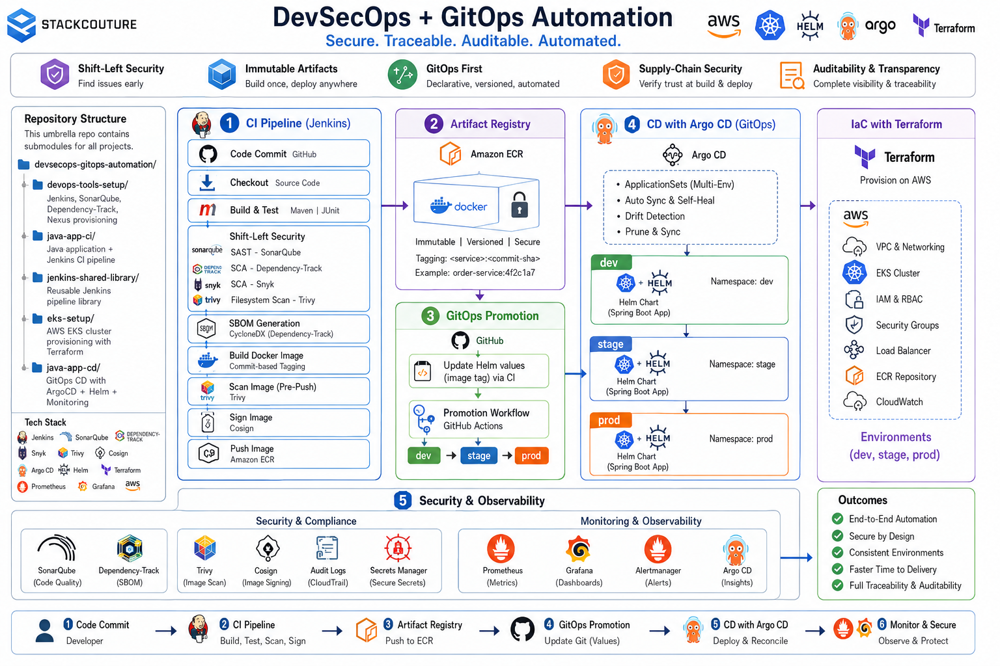

## 🚀 Project Overview

This project demonstrates a **production-oriented DevSecOps + GitOps delivery platform** that automates the complete software delivery lifecycle—from source code commit to Kubernetes deployment—while embedding **security, traceability, and operational reliability** into every stage.

The platform combines **CI/CD, Infrastructure as Code (IaC), Kubernetes, GitOps, and software supply chain security** to create a secure, repeatable, and auditable deployment workflow. Rather than treating security as a post-deployment activity, the pipeline enforces quality gates, vulnerability scanning, artifact integrity, and Git-driven deployments before applications reach production.

### ✨ Key Capabilities

- 🏗️ Infrastructure provisioning using **Terraform** on AWS
- ⚙️ Continuous Integration with **Jenkins**
- 🔍 Static Code Analysis using **SonarQube**
- 🛡️ Software Composition Analysis (SCA) using **Snyk**
- 🐳 Container vulnerability scanning with **Trivy**
- 📄 SBOM generation for software supply chain visibility
- ✍️ Container image signing using **Cosign**
- 📦 Artifact management with **Amazon ECR**
- 🚀 GitOps-based Continuous Delivery using **Argo CD** and **Helm**
- ☸️ Automated deployments to **Kubernetes**
- 📊 End-to-end traceability from **Git commit to production deployment**

### 🎯 Platform Engineering Principles

This project follows modern **Platform Engineering** and **DevSecOps** practices by ensuring every deployment is:

- ✅ Declarative
- 🔒 Immutable
- ♻️ Reproducible
- 📋 Fully auditable

Every infrastructure change, application update, and deployment is managed through **Git**, eliminating configuration drift while enabling safe rollbacks, controlled environment promotion, and consistent delivery across environments.

---
## Architecture



---
## Demo Flow


---

## ✨ Features  

### 🏗️ Infrastructure as Code (IaC)
Build and manage AWS cloud infrastructure using **Terraform** with modular, reusable, and version-controlled infrastructure.

- Provision Amazon EKS, VPC, IAM, and networking resources
- Modular and reusable Terraform modules for scalable infrastructure
- Automated infrastructure provisioning with Infrastructure as Code (IaC)
- Version-controlled infrastructure managed through Git for traceability and change management
- Repeatable deployments with minimal manual intervention

---
### ⚙️ Secure CI/CD Pipelines
Automate the complete application delivery lifecycle with integrated security controls.

- Jenkins pipelines powered by **Shared Libraries**
- Automated build, test, and packaging of Java Spring Boot applications
- **Shift-Left Security** integrated into the pipeline:
  - Static Application Security Testing (SAST) with **SonarQube**
  - Software Composition Analysis (SCA) using **Snyk**
  - Dependency and filesystem vulnerability scanning with **Trivy**
- Docker image build with immutable **Git commit-based tagging**
- Multi-stage container security scanning before and after image publishing
- Software Bill of Materials (**SBOM**) generation for supply chain visibility
- Container image signing using **Cosign** to ensure artifact integrity and authenticity
- Secure secrets management through **AWS Secrets Manager**
- Automated **Slack notifications** for pipeline status, deployment updates, and security scan results
- **Email notifications** for build success, failures, and deployment reports

---
### ☸️ Kubernetes Platform
Production-ready Kubernetes deployment practices for reliable application delivery.

- Automated application deployments to Amazon EKS
- **Argo CD + Helm** for multi-environment deployment  
- Declarative Kubernetes manifests
- **ApplicationSets** for scalable environment management  
- Promotion workflow via GitHub Actions (dev → stage → prod)  
- Automatic reconciliation ensures environments match Git

---
### 🛡️ DevSecOps & Supply Chain Security
Embed security throughout the software delivery lifecycle.

- Static code quality analysis
- Open-source dependency risk assessment
- Container vulnerability scanning
- Software Bill of Materials (SBOM) generation
- Cryptographic image signing with Cosign
- Secure artifact storage in **Amazon ECR**
- End-to-end software supply chain protection

---
### 📊 Monitoring & Observability

Gain real-time visibility into application and infrastructure health.

- **Prometheus** for metrics collection
- **Grafana** dashboards for application and Kubernetes monitoring
- Centralized security, vulnerability, and compliance reporting
- Performance monitoring and operational insights

---
### Repository Structure

This umbrella repo contains submodules pointing to individual projects:

```text
devsecops-gitops-automation/
│── devops-tools-setup/         # Jenkins, SonarQube, Dependency-Track, Nexus provisioning
│    ├── README.md
│    ├── LICENSE
│    ├── .gitignore
│    ├── versions.tf
│    ├── provider.tf
│    ├── variables.tf
│    ├── main.tf
│    ├── outputs.tf
│    └── terraform.tfvars.example
│    │
│    ├── modules/
│    │   ├── vpc/
│    │   ├── subnet/
│    │   ├── igw/
│    │   ├── rt/
│    │   ├── sg/
│        └── instance/
│    
│── java-app-ci/                 # Java application + Jenkins CI pipeline
│    ├──   .dockerignore
│    ├──   .gitignore
│    ├──   Dockerfile
│    ├──   Dockerfile-dev
│    ├──   Jenkinsfile
│    ├──   LICENSE
│    ├──   mvnw
│    ├──   mvnw.cmd
│    ├──   pom.xml
│    └──   README.md
├
│── jenkins-shared-library/      # Reusable Jenkins pipeline library
|    ├── LICENSE
|    ├── README.md
|    └── vars
|        ├── buildDockerImage.groovy
|        ├── checkEcrDigestExists.groovy
|        ├── checkoutAndVerifyGPG.groovy
|        ├── checkoutGit.groovy
|        ├── cleanupDockerImages.groovy
|        ├── cleanWorkspace.groovy
|        ├── confirmYamlUpdate.groovy
|        ├── cosignVerifyECR.groovy
|        ├── deployApp.groovy
|        ├── dockerPush.groovy
|        ├── getAwsSecret.groovy
|        ├── getImageDigest.groovy
|        ├── postBuildTestArtifacts.groovy
|        ├── runGptSecuritySummary.groovy
|        ├── runSnykScan.groovy
|        ├── runTrivyScanUnified.groovy
|        ├── scanReportDashboard.groovy
|        ├── sendAiReportEmail.groovy
|        ├── sendSlackNotification.groovy
|        ├── signImageWithCosign.groovy
|        ├── sonarQualityGateCheck.groovy
|        ├── sonarScan.groovy
|        ├── updateImageTag.groovy
|        └── uploadSbomToDependencyTrack.groovy
|
│── eks-setup/                   # AWS EKS cluster provisioning with Terraform
│    ├── README.md
│    ├── LICENSE
│    ├── .gitignore
│    ├── versions.tf
│    ├── provider.tf
│    ├── variables.tf
│    ├── main.tf
│    └── terraform.tfvars.example
│    │
│    ├── modules/
│    │   ├── eks/
│    │   ├── iam/
│    │   ├── network/
│        └── securitygroup/
|
│── java-app-cd/                 # GitOps CD with ArgoCD + Helm + Monitoring
│    ├── LICENSE
│    └── README.md
|    |
│    ├── .github
|    │    └── workflows
|    |          ├── promote-dev-stage.yml
|    |          └── promote-stage-prod.yml
|    |      
│    └── argoapps
|    |     ├── app-project.yaml
|    |     └── applicationset.yaml
|    |   
     └──helm-charts
        └── springboot
        |   └── Chart.yaml
        |   
        |   └── templates
        |       ├── deployment.yaml
        |       ├── ingress.yaml
        |       └── service.yaml
        |       
        |   └── values
                ├── dev-values.yaml
                ├── prod-values.yaml
                └── stage-values.yaml
```
---
## Design Principles

Our platform engineering approach is guided by the following core principles:

### Shift-Left Security
Detect and address security issues early in the development lifecycle, before artifacts are released.

### Immutable Artifacts
Ensure artifacts are built once and deployed exactly as tested, preventing drift and inconsistencies.

### GitOps First
Adopt declarative deployments to eliminate manual interventions and maintain a single source of truth.

### Supply-Chain Security
Verify trust at both build and deployment time to secure the entire software supply chain.

### Auditability & Transparency
Maintain complete visibility over all changes, builds, and security scans for compliance and traceability.

---

> **Note:** This repository represents a *reference DevSecOps implementation*. 

---
## How It Works

### CI Pipeline
- Builds, tests, runs security scans, generates SBOM, and builds & signs Docker images.

### Artifact Management
- Pushes artifacts to Amazon ECR using immutable digest-based tags.

### Environment Promotion
- CI updates Git values files.
- GitHub Actions manage promotion across environments.

### CD with Argo CD
- ApplicationSets deploy environments automatically.
- Self-healing and drift detection ensure consistency.

### Security & Observability
- Multi-layer security scans.
- Prometheus and Grafana dashboards provide monitoring and insights.

---

## Limitations

- Pipeline execution is slower due to multiple scans; better suited for main/gated branches.  
- Single pipeline combines CI/CD/security; production-grade platforms should split responsibilities.  
- Security thresholds depend on tooling and require continuous tuning.  
- Manual approval gates do not scale; policy-driven automation is recommended.  
- Some values are hardcoded for demo clarity; shared platforms require full parameterization.

---

## How I’d Evolve This at Scale

- **Separate Pipelines:** Split CI, security scans, and CD into independent pipelines for maintainability and parallel execution.  
- **Policy-Driven Approvals:** Replace manual gates with automated security and compliance checks.  
- **Dynamic Environments:** Automate ephemeral environments for feature branches using ApplicationSets.  
- **Centralized Security Dashboard:** Aggregate SAST, SCA, and container scan results into a single observability platform.  
- **Scaling GitOps:** Integrate multiple repositories with mono-/multi-tenant strategies for enterprise workloads.  
- **Enhanced Artifact Registry:** Implement artifact promotion policies and lifecycle management beyond ECR.
---

### Contributing

Contributions are welcome! Please fork this repo and open a PR.

Areas to contribute:
- Adding more security scanners (e.g., Checkov, tfsec, kube-bench)
- Extending monitoring dashboards
- Optimizing pipelines and GitOps automation

---

### License

You are free to use, copy, modify, merge, publish, distribute, sublicense and/or sell copies of the software, subject to the conditions in the license.

This project is provided under a **view-only** license for review and portfolio purposes.  
See the [LICENSE](./LICENSE) file for details.

---

### Acknowledgments

Inspired by modern DevSecOps practices from CNCF projects

Thanks to the open-source community for Terraform, Jenkins, ArgoCD, Helm, Prometheus, and Grafana

---
